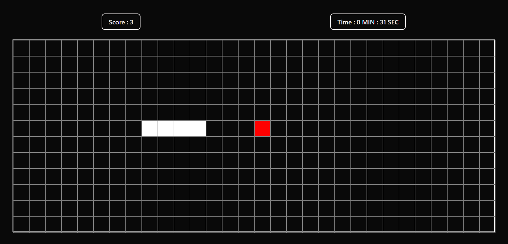

# 🐍 Snake Game

A classic Snake Game built using HTML, CSS, and Vanilla JavaScript.

The game features dynamic grid generation, score tracking, timer functionality, food spawning mechanics, and keyboard controls.

---

## 🚀 Features

- Dynamic game grid generation
- Real-time score tracking
- Built-in game timer
- Random food spawning
- Keyboard controls
- Collision detection
- Game over handling
- Responsive playground sizing
- Clean and minimal UI

---

## 🛠️ Technologies Used

- HTML5
- CSS3
- JavaScript (ES6)

---

## 🎮 How to Play

1. Open the game in your browser.
2. Use the arrow keys to control the snake:

| Key | Action |
|------|---------|
| ⬆️ | Move Up |
| ⬇️ | Move Down |
| ⬅️ | Move Left |
| ➡️ | Move Right |

3. Eat the red food blocks to increase your score.
4. Avoid hitting the walls.
5. The game ends when the snake collides with the boundary.

---

## 📂 Project Structure

```text
Snake-Game/
│
├── index.html
├── style.css
├── script.js
└── images
```

---

## 📸 Screenshots




---

## ⚙️ Installation

### Clone the Repository

```bash
git clone https://github.com/your-username/snake-game.git
```

### Open the Project

Simply open `index.html` in your browser.

No additional setup is required.

---

## 🔮 Future Improvements

- Pause / Resume functionality
- Restart button
- High score system
- Mobile touch controls
- Sound effects
- Difficulty levels
- Snake self-collision detection
- Local storage for score persistence
- Dark / Light themes

---

## 🤝 Contributing

Contributions, issues, and feature requests are welcome.

Feel free to fork this repository and submit a pull request.

---

## 👨‍💻 Author

Created by **Anshu Kharwar*

GitHub: https://github.com/anshu-Creates

---

## ⭐ Show Your Support

If you like this project, please give it a ⭐ on GitHub.
